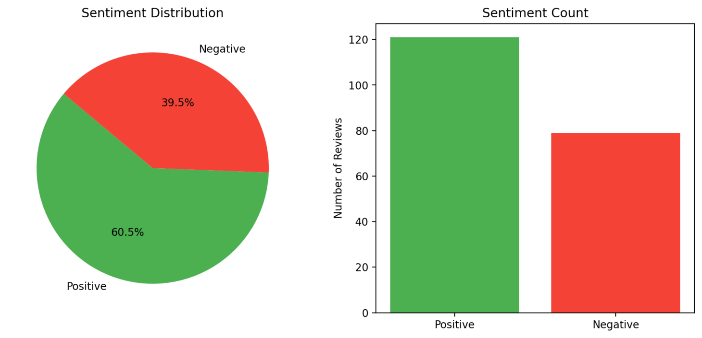

# 📱 Google Play Review Sentiment Analyzer

A web app that scrapes reviews from the Google Play Store and uses an AI model to analyze user sentiment — displaying a sentiment score out of 10 with beautiful visual charts.



---

## 🚀 Features

- 🔍 **Fetch Latest Reviews** — Scrapes up to 200 reviews of any app using its Google Play Store ID.
- 🤖 **Sentiment Classification** — Uses `distilbert-base-uncased-finetuned-sst-2-english` via Hugging Face Transformers.
- 📊 **Charts and Visualization** — Generates a pie chart and bar graph of sentiment distribution.
- 📈 **Score out of 10** — Based on ratio of positive to total reviews.
- 📝 **View Sample Reviews** — Preview real user feedback in the app.

---

## 🌐 Live Demo

> **Hosted on Streamlit Cloud**  
> 🔗 [Click here to try it online]([https://app-review-sentiment-analysis.streamlit.app](https://app-review-sentiment-analysis.streamlit.app))  

---

## 🧰 Tech Stack

- **Frontend:** [Streamlit](https://streamlit.io/)
- **Backend:** [Google Play Scraper](https://pypi.org/project/google-play-scraper/)
- **NLP Model:** [Hugging Face Transformers](https://huggingface.co/transformers/)
- **Charts:** [Matplotlib](https://matplotlib.org/)

---

## 🔧 Getting Started

### ✅ Prerequisites

Make sure you have Python 3.7+ installed.

### 📦 Installation

Clone the repository:

```bash
git clone https://github.com/your-username/google-play-review-analyzer.git
cd google-play-review-analyzer
